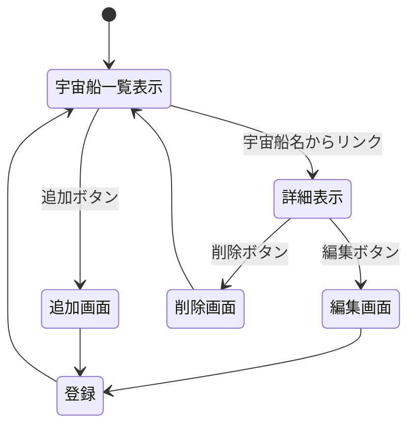

# 開発者用仕様書(仮) — スターウォーズ登場宇宙船一覧データ

## 1. 概要
スターウォーズ世界に登場する代表的な宇宙船を網羅的にまとめたデータセットを作成する．

## 2. データ構造

宇宙船1件あたりのデータ構造をミレニアム・ファルコンを例にとり以下に示す．

データ | 書式 | 例 
-|-|-
船名(英名) | name_en | Millennium Falcon 
船名(日本語) | name_jp | ミレニアム・ファルコン 
タイプ | type | 軽貨物船（改造型）
所属 | affiliation | 反乱軍", "レジスタンス
登場作品 | appearance | Episode IV: A New Hope
所有者，操縦者 | owners_pilots | ハン・ソロ

## ページ遷移

